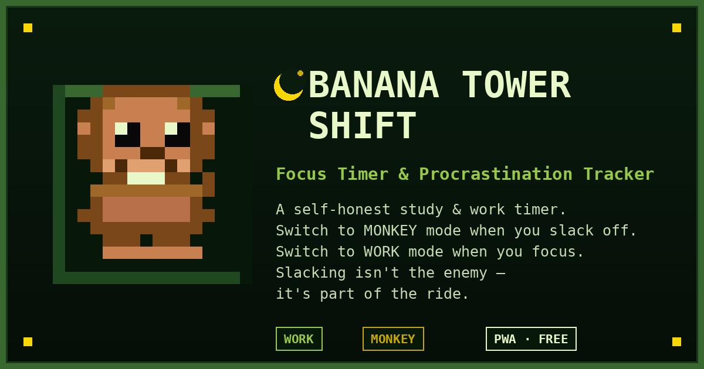

# 🍌 Banana Tower Shift

**Focus Timer & Procrastination Tracker**
集中タイマー & さぼり記録アプリ

**▶ Try it live: [https://egoaid.github.io/BANANA-TOWER-SHIFT/](https://egoaid.github.io/BANANA-TOWER-SHIFT/)**

---

## English

### What is this?

Banana Tower Shift is a Nintendo DS-style dual-screen PWA timer for studying and working.

You set a goal time — say, 30 minutes. Within that session, you honestly self-report how much of it was spent focused versus slacking off, by switching between two screens yourself:

- **🐒 MONKEY screen** — switch here when you're distracted. The monkey eats bananas and hurls the peels down to the worksite. Slack time runs, focus time pauses.
- **🏗️ WORK screen** — switch back when you're ready to focus. The worker sweeps up banana peels before building resumes. Focus time runs, slack time pauses.

At the end of the session, you see the full record: how much time went to focus, how much to slack — no judgment, just an honest picture.

### Our philosophy

**This app doesn't treat slacking off as something negative.**

Work time and slack time are both part of life. Taking a break, procrastinating, staring at the wall for a while — that's not failure, that's being human. This app isn't here to shame you into "zero slack time." It's here to give you an honest, lighthearted record of both — so you can notice your own rhythm and just enjoy the ride.

Don't stress about the numbers. The point isn't a perfect score. The point is showing up, being honest with yourself, and having a little fun with a monkey and a banana tower while you're at it.

### How to play

1. Select a goal time (10 / 30 / 45 / 60 / 90 min)
2. Press **▶ START**
3. Stay on the **WORK** screen while focused
4. Switch to the **MONKEY** screen yourself when you slack off — self-reported, no tracking, no judgment
5. Switch back to **WORK** whenever you're ready to continue
6. When time's up, see your session summary

### Scoring

Your **Purity** score reflects how much of the session was focus time vs. slack time.

| Grade | Purity | Title |
|-------|--------|-------|
| 🏰 | 90–100% | CATHEDRAL |
| 🏢 | 70–89% | GREAT WORK |
| 🏚️ | 50–69% | BANANA HALL |
| 🍌 | 30–49% | PEEL TOWER |
| 💀 | 0–29% | COLLAPSE |

The castle system: 6 bricks = 1 row, 10 rows = 1 castle. The more you slack, the more banana-yellow the castle turns — a playful, non-punitive way to see your session at a glance.

### Features

- 🎮 Nintendo DS pixel-art dual-screen layout
- 🌴 Animated jungle background — 3-layer parallax trees, wind sway, falling leaves, fireflies
- 🏙️ City background with neon signs, traffic, and a construction crane
- 📲 PWA — installable on iOS and Android, works offline
- 🔇 Sound toggle
- ⏸ Pause (shows a clock on the monkey screen, a calendar on the work screen)
- 🔁 Reset anytime

### Install as PWA

**iOS (Safari):** Open the site → Share button → **Add to Home Screen**
**Android (Chrome):** Open the site → Menu → **Add to Home Screen** / **Install app**

### Tech

- Vanilla HTML5 Canvas — no frameworks, no dependencies
- Single-file game engine, `requestAnimationFrame` loop
- Web Audio API for chiptune sound effects
- Service Worker for offline play

### License

Copyright © 2026 Takeshi Kawamoto. All rights reserved.
See [LICENSE](./LICENSE) for details.

---

## 日本語

### これは何？

Banana Tower Shiftは、ニンテンドーDS風の2画面構成で作られた、勉強・仕事用のPWAタイマーアプリです。

まず目標時間（例：30分）を設定します。そのセッションの中で、「今どれだけ集中できていて、どれだけサボっているか」を、自分の手で画面を切り替えることで自己申告していきます。

- **🐒 MONKEYの画面** — サボるときにここに切り替えます。お猿さんがバナナを食べて、皮を工事現場に投げ捨てます。サボり時間が進み、集中タイマーは止まります。
- **🏗️ WORKの画面** — 集中に戻るときにここに切り替えます。作業員がバナナの皮を片付けてから、建設を再開します。集中時間が進み、サボりタイマーは止まります。

セッションが終わると、集中時間とサボり時間の全記録が表示されます。裁くためではなく、正直な記録を見るためのものです。

### このアプリの想い

**このアプリは、サボり時間をネガティブなものとして捉えていません。**

集中している時間も、サボっている時間も、どちらも人生の一部です。休憩すること、先延ばしにしてしまうこと、少しぼーっとしてしまうこと——それは失敗ではなく、人間らしさです。このアプリは「サボり時間ゼロ」を目指させて追い詰めるためのものではありません。集中もサボりも、両方を正直に、そして軽やかに記録することで、自分自身のリズムに気づき、日々を楽しんでもらうためのものです。

数字にストレスを感じる必要はありません。大事なのは完璧なスコアを出すことではなく、まず取り組んでみること、自分に正直でいること、そしてお猿さんとバナナタワーと一緒に、ちょっと楽しむことです。

### 遊び方

1. 目標時間を選ぶ（10 / 30 / 45 / 60 / 90分）
2. **▶ START** を押す
3. 集中しているときは **WORK** 画面のまま
4. サボるときは自分で **MONKEY** 画面に切り替える（自己申告制。監視や採点のためではありません）
5. 集中に戻る準備ができたら、自分で **WORK** 画面に切り替える
6. 時間が来たら、セッションの記録を確認する

### スコアについて

**Purity（純度）** スコアは、セッション全体のうち集中時間がどれだけの割合を占めたかを表します。

| ランク | Purity | タイトル |
|-------|--------|---------|
| 🏰 | 90〜100% | CATHEDRAL（大聖堂） |
| 🏢 | 70〜89% | GREAT WORK（好調） |
| 🏚️ | 50〜69% | BANANA HALL（バナナホール） |
| 🍌 | 30〜49% | PEEL TOWER（皮の塔） |
| 💀 | 0〜29% | COLLAPSE（崩壊） |

お城システム：レンガ6個で1列、10列で1つのお城が完成します。サボるほどお城がバナナ色に染まっていきますが、これは罰ではなく、セッションをひと目で振り返るための遊び心のある演出です。

### 機能

- 🎮 ニンテンドーDS風ドット絵デュアルスクリーン
- 🌴 3層視差スクロールのジャングル背景、風で揺れる木々、落ち葉、蛍
- 🏙️ ネオンサイン・交通・クレーンのある都市背景
- 📲 PWA対応 — iOS/Androidにインストール可能、オフラインでも動作
- 🔇 サウンドON/OFF切り替え
- ⏸ 一時停止（MONKEY画面に時計、WORK画面にカレンダーを表示）
- 🔁 いつでもリセット可能

### PWAとしてインストール

**iOS（Safari）：** サイトを開く → 共有ボタン → **ホーム画面に追加**
**Android（Chrome）：** サイトを開く → メニュー → **ホーム画面に追加** / **アプリをインストール**

### 技術構成

- Vanilla HTML5 Canvas — フレームワーク・依存関係なし
- 単一ファイルのゲームエンジン、`requestAnimationFrame` ループ
- Web Audio API によるチップチューンサウンド
- Service Worker によるオフライン対応

### ライセンス

Copyright © 2026 Takeshi Kawamoto. All rights reserved.
詳細は [LICENSE](./LICENSE) をご覧ください。
